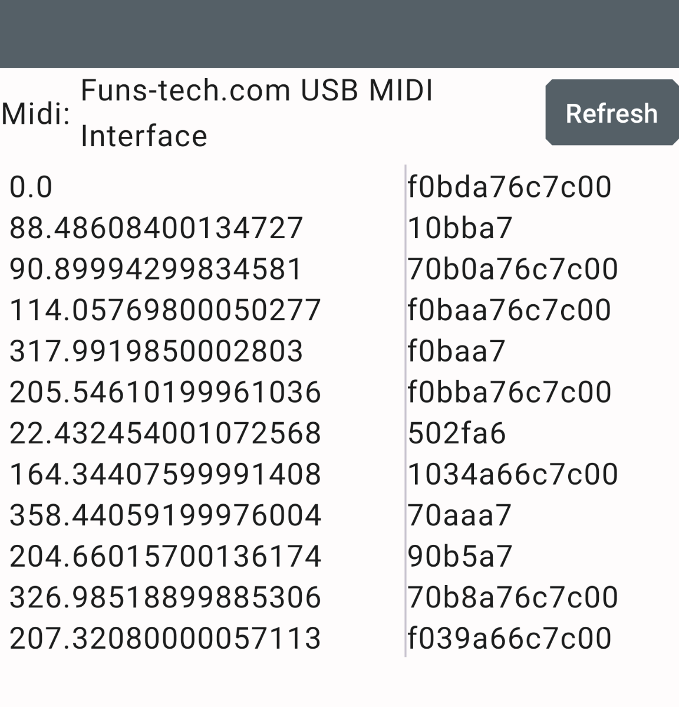

# Example Android Studio project

Simple app using RtMidi. There are symlinks to 3 files in the main RtMidi project
* RtMidi.cpp
* RtMidi.h
* MidiDeviceOpenedListener.java

The main goal of this project is to demonstrate how to build RtMidi into an Android app. The
app itself simply lists midi devices, opens the selected port and prints out any incoming packet



## Using RtMidi in your own app

Two things are easy to miss:

**`MidiDeviceOpenedListener.java` has to be in your APK.** The Android MIDI API
opens devices asynchronously through a Java listener, so the backend needs that
class at runtime, in package `com.yellowlab.rtmidi`. It ships in
`contrib/java/`. Without it you get

    java.lang.ClassNotFoundException: com.yellowlab.rtmidi.MidiDeviceOpenedListener

**Do not construct an `RtMidiIn` or `RtMidiOut` in a static initializer.** A
static initializer runs while `System.loadLibrary()` is still loading your
library, before the JNI environment is usable. Construct on first use instead:

    static RtMidiIn* midiLib = NULL;

    static RtMidiIn* getMidiLib() {
        if ( midiLib == NULL )
            midiLib = new RtMidiIn( RtMidi::Api::ANDROID_AMIDI );
        return midiLib;
    }

## Building the library for Android

The Android backend must be built with CMake; the Autotools path does not
support it. Cross-compile with the NDK's CMake toolchain file:

```
cmake -B build-android \
  -DCMAKE_TOOLCHAIN_FILE=<ndk>/build/cmake/android.toolchain.cmake \
  -DANDROID_ABI=arm64-v8a -DANDROID_PLATFORM=android-29 \
  -DRTMIDI_API_AMIDI=ON
cmake --build build-android
```

`RTMIDI_API_AMIDI` defaults to on when the CMake toolchain sets `ANDROID`. If
the host system has JACK installed you will also need `-DRTMIDI_API_JACK=OFF`,
because the JACK probe currently inspects the host rather than the target
(issue #383).

## Minimum API level

The Android backend requires **API 29** (Android 10), which is where the AMidi
NDK API was introduced.

Do not link `libnativehelper`. The JVM pointer is obtained from `JNI_OnLoad`,
falling back to `dlsym()` when the library was not loaded by the Java runtime.
Linking `libnativehelper` for `JNI_GetCreatedJavaVMs()` would raise the minimum
to API 31, since that is the first level the NDK ships it for.

Link `log`, `amidi` and `dl`.
